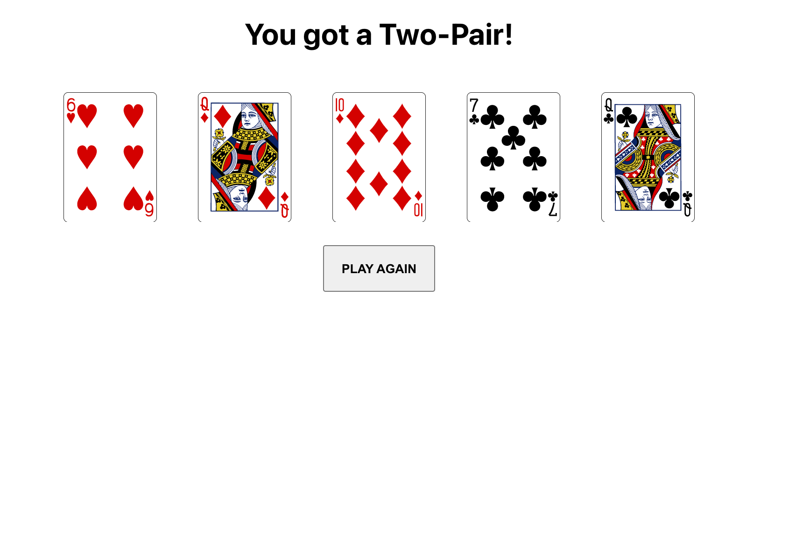

# Five-Card-Draw Poker

Built using create-react-app. To get started run `npm start`.

Has not been throughly tested, I've run into some minor issues but nothing that compromises the overall game.

Uses [cardJS](https://github.com/richardschneider/cardsJS) for the card svg images. Everything else is built by hand except for a few utility functions that have the citations right above them.

**Note**: The game does not let you discard cards until you have picked at least one, not sure if this is the correct way to play the game; however I designed it to be like that.

